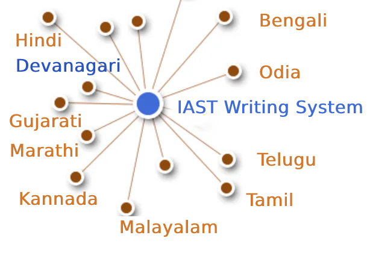

<h1 align="center">

</h1>

# IASTFrameWork

**IAST FrameWork** is a NLP FrameWork build specifically for [Indic Languages/Scripts](https://en.wikipedia.org/wiki/Brahmic_scripts) <br>
Where **IAST Script** [lossless romanisation of [Indic scripts](https://en.wikipedia.org/wiki/Brahmic_scripts) to  [Latin script](https://en.wikipedia.org/wiki/Latin_script)] is used as base for all Indic Languages 

**IAST FrameWork** consist of 
- Lossless convertion of Indic Languages (Hindi, Gujarathi, Malayalam , Kannada, Telugu, Tamil, Odia, Bengali )  into **IAST Script** `iast.to_iast(indic_script)`
- Convert **IAST Script**  to Indic Languages (Hindi, Malyalam, Kannada, Telugu) `iast.iast2indic(iast_script,indic_lang)`<br>
    for Tamil, Odia, Bengali, Gujarathi in progress
- Use IAST Char as Phonetic Hash for **Phonetic Based Search Algorithm** `IAST.basic_hash` and `IAST.normal_hash`
- Using  **IAST Phonetic Hash** for Search Algorithm
<br>
<br>
Future Scope

- Creating and Linking Indic Language  OpenSource Dictionary  Olam, Alar dictionary, [Monier Williams Sanskrit Dictionary](https://kosha.sanskrit.today/word/en/stem#) [github GNU Licence v3](https://github.com/drdhaval2785/PyCDSL)   ...etc <br>
    linking dictionary either by it 
    - **pronunciation** *(phonetic hash)* or 
    - by it **meaning**.
    - Steam word and Lemmatization word in both lanaguages
- Using IAST as writing system: Creating Steamming and Lemmatization library for (Common Words) in all Indic languages.<br>
    Most of Indic Language word has (common words) most of them are derived from sanskrit


- Creating OpenSouce DataSet of common Indic Language NER Library simillar to   https://stanfordnlp.github.io/CoreNLP/assets/images/demo.png using<br> OpenSource Tools: <br>
https://github.com/prasadchandan/st_ner_annotate <br>
https://github.com/explosion/spacy-streamlit <br>


- Using IAST as Language as basis for **NLU** Natural Language Understanding for all Indic language.<br>
    Simillar Rules,Grammer can be group<br>
    **Advatages of IAST**: Suppose if we develop OpenSource NLU for ( Kannada or Malayalam) then due to IAST writing system the logic  can be easily understanded by other Indic User like (Tamil, Telug, Hindi)...etc<br>
    This will help other Indic Language NLP developer to understand and develop NLP for there Indic Language.

- Using IAST as Language as basis for **NLG** Natural Language Generation for all Indic language.<br>


# IAST
**[IAST](https://en.wikipedia.org/wiki/International_Alphabet_of_Sanskrit_Transliteration):** International Alphabet of Sanskrit Transliteration  is a transliteration scheme that allows the lossless romanisation of [Indic scripts](https://en.wikipedia.org/wiki/Brahmic_scripts) as employed by Sanskrit and related Indic languages.<br>
**[ISO 15919](https://en.wikipedia.org/wiki/ISO_15919)** published in 2001 and uses [diacritics](https://en.wikipedia.org/wiki/Diacritic) to map the much larger set of consonants and vowels in Brahmic and Nastaliq scripts to the [Latin script](https://en.wikipedia.org/wiki/Latin_script). <br>
Here is the table which is used in the code to link different Indic Scripts https://docs.google.com/spreadsheets/d/1wS98RWxqCQOCoR2H-E9kW0FUXC_Kvqoiz6NzSB2Fdto/


## Usage

```python
import sqlite3
import sys
#from IAST import IAST
from IASTFramework import IAST

db_path ='iast-map-modified.db'
# db_path = 'iast-token.db'    
table_name_alpha= 'IndianAlphabet'
table_name_barakadi= 'Barakhadi'
iast = IAST(db_path,table_name_alpha,table_name_barakadi)
```

# Convert Indic Language to IAST

Convert hindi, Bengali,Gujarati, Kannadam Odia, Tamil, Telugu to `iast` format 

## SQL query to search Indic Character in all Lanaguages

```sql
SELECT * FROM IndianAlphabet 
    WHERE Devanagari == 'ध' 
        OR Bengali–Assamese == 'ध' OR Gujarati == 'ध' 
        OR Kannada == 'ध' OR Malayalam == 'ध' 
        OR Odia == 'ध' OR Tamil == 'ध' 
        OR Telugu == 'ध';
```
Output 

```python
[{'type': 'consonants',
  'IAST': 'dha',
  'Devanagari': 'ध',
  'Bengali–Assamese': 'ধ',
  'Gujarati': 'ધ',
  'Gurmukhi': 'ਧ',
  'Kannada': 'ಧ',
  'Malayalam': 'ധ',
  'Nastaliq': 'دھ',
  'Odia': 'ଧ',
  'Sinhala': 'ධ',
  'Tamil': None,
  'Telugu': 'ధ'}]
```


```python
print(iast.alphabet) # IndianAlphabet
print(iast.barakhadi)  # Barakhadi
query = IAST.get_iast_idx_query('ध',iast.alphabet) # 
print(query.replace('\n','').replace("  ","").replace('OR',' OR')) 
# print()
iast.get_query(query)
# [{'IAST': 'dha', 'Devanagari': 'ध', 'Bengali–Assamese': 'ধ', 'Gujarati': 'ધ', 'Gurmukhi': 'ਧ', 'Kannada': 'ಧ', 'Malayalam': 'ധ', 'Nastaliq': 'دھ', 'Odia': 'ଧ', 'Sinhala': 'ධ', 'Tamil': None, 'Telugu': 'ధ'}]

```

    IndianAlphabet
    Barakhadi
    SELECT * FROM IndianAlphabet WHERE Devanagari == 'ध' OR Bengali–Assamese == 'ध' OR Gujarati == 'ध' OR Kannada == 'ध' OR Malayalam == 'ध' OR Odia == 'ध' OR Tamil == 'ध' OR Telugu == 'ध';


    [{'type': 'consonants',
      'IAST': 'dha',
      'Devanagari': 'ध',
      'Bengali–Assamese': 'ধ',
      'Gujarati': 'ધ',
      'Gurmukhi': 'ਧ',
      'Kannada': 'ಧ',
      'Malayalam': 'ധ',
      'Nastaliq': 'دھ',
      'Odia': 'ଧ',
      'Sinhala': 'ධ',
      'Tamil': None,
      'Telugu': 'ధ'}]


```python
print(iast.get_halant_list()) #>>  ['्', '্', '્', '್', '്', '୍', '్']
print(iast.('ధృత్రాష్ట్ర ఉవాచ'))
# iast.halant_list
```

    ['्', '্', '્', '್', '്', '୍', '్']
    dhr̥trāṣṭra uvāca


## Convert Indic sting to iast format `iast.to_iast(word)` 

```python
# def to_iast(self,word): 
to_iast = ''
for letter in word: # word
    query = IAST.get_iast_idx_query(letter,self.alphabet)    
    alpha_token =self.get_query(query)
    
    query = IAST.get_iast_idx_query(letter,self.barakhadi)    
    barakhadi_token =self.get_query(query)
    
    if len(alpha_token) !=0:
        to_iast += alpha_token[0]['IAST']
    elif letter in  self.halant_list and to_iast[-1] in "a":  # >> 'क्' => 'क ' +'्'   # >>> ka + halant = k
        to_iast = to_iast[:-1]
    elif len(barakhadi_token) !=0 and to_iast[-1] in "a":     # >> 'कि' => 'क ' + 'ि' = ka + i => ki
        to_iast = to_iast[:-1]+ barakhadi_token[0]['IAST']
    elif len(barakhadi_token) !=0 :                           # >> ' किं ' =>'क ' + 'ि' + 'ं'  = ka + i + aṁ = kiṁ
        to_iast += barakhadi_token[0]['IAST'].replace("a",'')
    elif len(barakhadi_token) ==0  and len(alpha_token) ==0 and ord(letter)==8205: # cleaing data
        pass
    else:
        # print(f"""NOT Present in alpha and barakadi{letter}=={ord(letter)} """)
        to_iast += letter
```


```python
text = '''ଧୃତରାଷ୍ଟ୍ର ଉଵାଚ |\tধৃতরাষ্ট্র উবাচ |\tધૃતરાષ્ટ્ર ઉવાચ |\tத்றுதராஷ்ட்ர உவாச |'''
print(iast.to_iast(text))
```

    dhr̥tarāṣṭra uvāca |	dhr̥tarāṣṭra ubāca |	dhr̥tarāṣṭra uvāca |	ta்ṟutarāṣa்ṭa்ra uvāca |


## Debug `to_iast` : character by character 


```python
text = 'த்றுதராஷ்ட்ர உவாச'
print(iast.to_iast(text))
iast.debug_letterbyletter(text)
# chr(805)
```

    ta்ṟutarāṣa்ṭa்ra uvāca
    letter= த 	| ascii(letter) =2980	| iast = ta
    letter= ் 	| ascii(letter) =3021	| iast = ்
    letter= ற 	| ascii(letter) =2993	| iast = ṟa
    letter= ு 	| ascii(letter) =3009	| iast = u
    letter= த 	| ascii(letter) =2980	| iast = ta
    letter= ர 	| ascii(letter) =2992	| iast = ra
    letter= ா 	| ascii(letter) =3006	| iast = ā
    letter= ஷ 	| ascii(letter) =2999	| iast = ṣa
    letter= ் 	| ascii(letter) =3021	| iast = ்
    letter= ட 	| ascii(letter) =2975	| iast = ṭa
    letter= ் 	| ascii(letter) =3021	| iast = ்
    letter= ர 	| ascii(letter) =2992	| iast = ra
    letter=   	| ascii(letter) =32	| iast =  
    letter= உ 	| ascii(letter) =2953	| iast = u
    letter= வ 	| ascii(letter) =2997	| iast = va
    letter= ா 	| ascii(letter) =3006	| iast = ā
    letter= ச 	| ascii(letter) =2970	| iast = ca


## Testing `iast.to_iast(word)`


```python
# for line in text_telugu.strip().split('\n'):
# source : https://hinduliterature.org/tamil/scriptures/srimad_bhagawad_gita_chapter_1.php
file_name ='bg-hinid'
with open (file_name,'r') as f:
   f_hindi = f.read()  

file_name ='bg-kannada'
with open (file_name,'r') as f:
   f_kanada = f.read()  

file_name ='bg-malayalam'
with open (file_name,'r') as f:
   f_malayalam = f.read()  

file_name ='bg-telugu'
with open (file_name,'r') as f:
   f_telugu = f.read()  

file_name ='bg-oriya'
with open (file_name,'r') as f:
   f_oriya = f.read()  

file_name ='bg-bengali'
with open (file_name,'r') as f:
   f_bengali = f.read()  

file_name ='bg-gujarati'
with open (file_name,'r') as f:
   f_gujarati = f.read()  

file_name ='bg-tamil'
with open (file_name,'r') as f:
   f_tamil = f.read()  

print(len( f_telugu.split('\n')),len(f_kanada.split('\n')), len(f_malayalam.split('\n')), len(f_hindi.split('\n')  ))

min_len  = min(len( f_telugu.split('\n')),len(f_kanada.split('\n')), len(f_malayalam.split('\n')), len(f_hindi.split('\n')  ))
print(f"""LANGUAGE\t| Origian Language Script \t| IAST CONVERT Script """)
for line_idx in range(min_len-1):
    print(line_idx)
    print("-"*40)
    line = f_telugu.strip().split('\n')[line_idx]
    if len(line):
        print(f"""TEL\t| {line.strip()}\t| {iast.to_iast( line)} """)
    line = f_kanada.strip().split('\n')[line_idx]
    if len(line):
        print(f"""KAN\t| {line.strip()}\t| {iast.to_iast( line)} """)
    line = f_malayalam.strip().split('\n')[line_idx]
    if len(line):
        print(f"""MAL\t| {line.strip()}\t| {iast.to_iast( line)} """)
    line = f_hindi.strip().split('\n')[line_idx]
    if len(line):
        print(f"""HIN\t| {line.strip()}\t| {iast.to_iast( line)} """)
        # print(f""" {iast.to_iast( line)} """)
    line = f_oriya.strip().split('\n')[line_idx]
    if len(line):
        print(f"""ORI\t| {line.strip()}\t| {iast.to_iast( line)} """)

    line = f_bengali.strip().split('\n')[line_idx]
    if len(line):
        print(f"""BEN\t| {line.strip()}\t| {iast.to_iast( line)} """)
        
    line = f_gujarati.strip().split('\n')[line_idx]
    if len(line):
        print(f"""GUJ\t| {line.strip()}\t| {iast.to_iast( line)} """)

    line = f_tamil.strip().split('\n')[line_idx]
    if len(line):
        print(f"""TAM\t| {line.strip()}\t| {iast.to_iast( line)} """)
```

    157 469 157 140
    LANGUAGE	| Origian Language Script 	| IAST CONVERT Script 
    0
    ----------------------------------------
    TEL	| ధృతరాష్ట్ర ఉవాచ |	| dhr̥tarāṣṭra uvāca | 
    KAN	| ಧೃತರಾಷ್ಟ್ರ ಉವಾಚ ।	| dhr̥tarāṣṭra uvāca | 
    MAL	| ധൃതരാഷ്ട്ര ഉവാച ।	| dhr̥tarāṣṭra uvāca | 
    HIN	| धृतराष्ट्र उवाच	| dhr̥tarāṣṭra uvāca 
    ORI	| ଧୃତରାଷ୍ଟ୍ର ଉଵାଚ |	| dhr̥tarāṣṭra uvāca | 
    BEN	| ধৃতরাষ্ট্র উবাচ |	| dhr̥tarāṣṭra ubāca | 
    GUJ	| ધૃતરાષ્ટ્ર ઉવાચ |	| dhr̥tarāṣṭra uvāca | 
    TAM	| த்றுதராஷ்ட்ர உவாச |	| ta்ṟutarāṣa்ṭa்ra uvāca | 
    1
    ----------------------------------------
    KAN	| ಧರ್ಮಕ್ಷೇತ್ರೇ ಕುರುಕ್ಷೇತ್ರೇ ಸಮವೇತಾ ಯುಯುತ್ಸವಃ ।	| dharmakṣētrē kurukṣētrē samavētā yuyutsavaḥ | 
    MAL	| ധർമക്ഷേത്രേ കുരുക്ഷേത്രേ സമവേതാ യുയുത്സവഃ ।	| dhaṟmakṣētrē kurukṣētrē samavētā yuyutsavaḥ | 
    HIN	| धर्मक्षेत्रे कुरुक्षेत्रे समवेता युयुत्सव: ।	| dharmakṣētrē kurukṣētrē samavētā yuyutsavaḥ | 
    ORI	| ଧର୍ମକ୍ଷେତ୍ରେ କୁରୁକ୍ଷେତ୍ରେ ସମଵେତା ୟୁୟୁତ୍ସଵଃ |	| dharmakṣētrē kurukṣētrē samavētā ẏuẏutsavaḥ | 
    BEN	| ধর্মক্ষেত্রে কুরুক্ষেত্রে সমবেতা য়ুয়ুত্সবঃ |	| dharmakṣētrē kurukṣētrē samabētā ẏuẏutsabaḥ | 
    GUJ	| ધર્મક્ષેત્રે કુરુક્ષેત્રે સમવેતા યુયુત્સવઃ |	| dharmakṣētrē kurukṣētrē samavētā yuyutsavaḥ | 
    TAM	| தர்மக்ஷேத்ரே குருக்ஷேத்ரே ஸமவேதா யுயுத்ஸவஃ |	| tara்maka்ṣēta்rē kuruka்ṣēta்rē samavētā yuyuta்savaḵa | 
    ...
    138
    ----------------------------------------
    TEL	| ఉత్సాద్యంతే జాతిధర్మాః కులధర్మాశ్చ శాశ్వతాః || 43 ||	| utsādyaṁtē jātidharmāḥ kuladharmāśca śāśvatāḥ || 43 || 
    HIN	| विसृज्य सशरं चापं शोकसंविग्न‍मानसः ॥ ४६ ॥	| visr̥jya saśaraṁ cāpaṁ śokasaṁvignamānasaḥ || 46 || 
    ORI	| ନରକେ‌உନିୟତଂ ଵାସୋ ଭଵତୀତ୍ୟନୁଶୁଶ୍ରୁମ || 44 ||	| narakē‌uniẏataṁ vāso bhavatītẏanuśuśruma || 44 || 


## Use Case of `iast.to_iast(word)` 


```python
f_tamil = """ആലായാല്‍ തറ വേണം  അടുത്തൊരമ്പലം വേണം
ആലിനു ചേര്‍ന്നൊരു കുളവും വേണം
കുളിപ്പാനായ് കുളം വേണം  കുളത്തില്‍ ചെന്താമര വേണം
കുളിച്ച് ചെന്നകം പുക്കാന്‍ ചന്ദനം വേണം

പൂവായാല്‍ മണം വേണം  പൂമാനായാല്‍ ഗുണം വേണം
പൂമാനിനിമാര്‍കള്‍ അടക്കം വേണം

യുദ്ധത്തിങ്കല്‍ രാമന്‍ നല്ലൂ, കുലത്തിങ്കല്‍ സീത നല്ലൂ
ഊണുറക്കമുപേക്ഷിക്കാന്‍ ലക്ഷ്മണന്‍ നല്ലൂ
പടയ്ക്ക് ഭരതന്‍ നല്ലൂ, പറവാന്‍ പൈങ്കിളി നല്ലൂ
പറക്കുന്ന പക്ഷികളില്‍ ഗരുഢന്‍ നല്ലൂ

നാടായാല്‍ നൃപന്‍ വേണം  അരികില്‍ മന്ത്രിമാര്‍ വേണം
നാടിനു ഗൂണമുള്ള പ്രജകള്‍ വേണം..

മങ്ങാട്ടച്ചനു ന്യായം നല്ലൂ മംഗല്യത്തിനു സ്വര്‍ണ്ണേ നല്ലൂ
മങ്ങാതിരിപ്പാന്‍ നിലവിളക്ക് നല്ലൂ.

പാല്യത്തച്ചനുപായം നല്ലൂ പാലില്‍ പഞ്ചസാര നല്ലൂ
പാരാതിരിപ്പാന്‍ ചില പദവി നല്ലൂ
"""
# f_tamil = text
lines = f_tamil.strip().split('\n')
for line in lines:
    if len(line):
        print(f"""{iast.to_iast( line)} """)
        # print(f"""MAL \t {line.strip()}\t {iast.to_iast( line)} """)
```

    ālāyāl taṟa vēṇaṁ  aṭuttorampalaṁ vēṇaṁ 
    ālinu cērnnoru kuḷavuṁ vēṇaṁ 
    kuḷippānāy kuḷaṁ vēṇaṁ  kuḷattil centāmara vēṇaṁ 
    kuḷicc cennakaṁ pukkān candanaṁ vēṇaṁ 
    pūvāyāl maṇaṁ vēṇaṁ  pūmānāyāl guṇaṁ vēṇaṁ 
    pūmāninimārkaḷ aṭakkaṁ vēṇaṁ 
    yuddhattiṅkal rāman nallū, kulattiṅkal sīta nallū 
    ūṇuṟakkamupēkṣikkān lakṣmaṇan nallū 
    paṭaykk bharatan nallū, paṟavān paiṅkiḷi nallū 
    paṟakkunna pakṣikaḷil garuḍhan nallū 
    nāṭāyāl nr̥pan vēṇaṁ  arikil mantrimār vēṇaṁ 
    nāṭinu gūṇamuḷḷa prajakaḷ vēṇaṁ.. 
    maṅṅāṭṭaccanu nyāyaṁ nallū maṁgalyattinu svarṇṇē nallū 
    maṅṅātirippān nilaviḷakk nallū. 
    pālyattaccanupāyaṁ nallū pālil pañcasāra nallū 
    pārātirippān cila padavi nallū 


# IAST to Indic Language `iast.iast2indic(iast_word,indic_lang)` 

Step to iast_string to indic language
- convert given **iast_string** `kiṁ rānsakhīṁ` to **iast_tokens**  `['k', 'i', 'ṁ',' ', 'r', 'ā', 'n', 's', 'a', 'kh', 'ī', 'ṁ', 's', 't', 'a', 'th', 'ā']`
```python
IAST.iast2tokens('kiṁ rānsakhīṁ') # >>> ['k', 'i', 'ṁ',' ', 'r', 'ā', 'n', 's', 'a', 'kh', 'ī', 'ṁ', 's', 't', 'a', 'th', 'ā']
```
- Convert token to `indic lang` add properties(language, vowel/consonant, charater symbol) to each  **token**  `['k', 'i', 'ṁ']`

```python
tokens = IAST.iast2tokens('kiṁ')    # >>> `['k', 'i', 'ṁ']`
iast.tokens2dict_tokenes(tokens,indic_lang)
# >>>
[
 {'IAST': 'k', 'lang': 'Telugu', 'type': 'consonants', 'alph': 'క', 'bara': None},
 {'IAST': 'i', 'lang': 'Telugu', 'type': 'vowel', 'alph': 'ఇ', 'bara': 'ి'},
 {'IAST': 'ṁ', 'lang': 'Telugu', 'alph': None, 'type': 'vowel', 'bara': 'ం'},
]
```
- Convert **list of dict** to `indic_lang` string `కిం`


## IAST String to tokens `IAST.iast2tokens(word)`

iast string is split into group of iast character : some like `kha` and `ka` we need prioritise `kha` so we created priority dictionary
```python
vowel_plist=[['r̥̄', 'l̥̄'],  # len of iast char is 3
             ['r̥', 'au', 'ai', 'ụ̄ ', 'ạ̄ ', 'oṁ', 'm̐', 'aḥ', 'l̥'],  # len of iast char is 2
             ['a', 'ā', 'ạ', 'ụ', 'æ', 'ǣ', 'i', 'ī', 'u', 'ū', 'e', 'ē', 'ê', 'ê',
              'o', 'ǒ', 'ō', 'ô', 'ʻ', 'ḥ', 'ḫ', 'ẖ', 'ṁ', 'ṃ']     # len of iast char is 1
            ]

consonant_list = [['n̆g', 'n̆j', 'n̆ḍ', 'n̆d', 'm̆b', 'k͟h'], # len of iast char is 3
                   ['kh', 'g̈', 'gh', 'ch', 'ĉh', 'jh', 'ṭh', 'ḍh', 'dh', 'd̤', 
                    'ṛh', 'th', 'ph', 'bh', 'b̤', 'ṟ̄', 'y̌', 'r̆', 'l̤', '||'], # len of iast char is 2
                   ['ḵ', 'k', 'g', 'ṅ', 'c', 'ĉ', 'j', 'ǰ', 'ĵ', 'ñ', 'ṭ', 'ḍ', 'ḍ', 
                    'ṛ', 'ṇ', 't', 'd', 'n', 'p', 'b', 'm', 'ṟ', 'ṯ', 'ḏ', 'ṉ',
                    'ḻ', 'y', 'ẏ', 'r', 'l', 'ḷ', 'v', 'ś', 'ṣ', 's', 'h', 'q', 'ġ', 
                    'z', 'z', 'ž', 'ž', 'ž', 'f', 's̱', 's̤', 'h̤', 't̤', 'w',
                    'ẕ', 'ż', 'ẓ', 'ẏ', 'ṟ', 
                    '0', '1', '2', '3', '4', '5', '6', '7', '8', '9', '|']  # len of iast char is 1
                  ]
                  
# def iast2tokens(word):
vowel_plist=IAST.vowel_plist
consonant_list=IAST.consonant_list

iast_tokens= []
vowel_tokens = IAST.lex_iast(vowel_plist,word)
# print(vowel_tokens)
if word[-1*len(vowel_tokens[-1]):]==vowel_tokens[-1]:
    pass
    # print('Last word match with vowel no need to append')
else:
    vowel_tokens.append(word.split(vowel_tokens[-1])[-1])
    # print('need to append')
    # print(vowel_tokens)
for i in vowel_tokens:
    # print(i, lex_iast(consonant_list,i))
    if len(IAST.lex_iast(consonant_list,i)) <=1:
        iast_tokens.append(i)
    else:
        iast_tokens.extend(IAST.lex_iast(consonant_list,i))                  
iast_tokens
```

### `lex_token` 

`lex_token` is Lexical analysis of `iast string(word)` which is to be converted into tokens <br>
For given input string there are 3 sliding window try to match the keyword of diff len 
```python
def lex_iast(keyword, word):
    tokens=[]
    slic_pstart = 0 # previous start point
    
    len_word = len(word)
    slic3_flag = False
    slic2_flag = False
    slic1_flag = False
    
    for idx, letter in enumerate(word):
        slic3 = word[idx:idx+3]
        if slic3 in keyword[0]:
            slic3_flag=True
        else:
            slic3_flag=False
        slic2 = word[idx:idx+2]            
        if slic2 in keyword[1]:
            slic2_flag=True
        else:
            slic2_flag=False        
        slic1 = word[idx:idx+1]        
        if slic1 in keyword[2]:
            slic1_flag=True
        else:
            slic1_flag=False
    
        if slic3_flag:
            if slic_pstart < idx:
                # print(f'Append missing data btw idx slic3 {slic_pstart}:{idx} {word[slic_pstart:idx]}' )                                                    
                tokens.append(word[slic_pstart:idx])
            tokens.append(slic3)                
            slic_pstart=idx+1 + len(slic3)-1
            # print(f'At index {idx} :Need to split3 at {slic3}' )
        else:
            if slic2_flag:
                if slic_pstart < idx:
                    # print(f'Append missing data btw idx slic2 {slic_pstart}:{idx} {word[slic_pstart:idx]}' )                                    
                    tokens.append(word[slic_pstart:idx])            
                # if slic_pstart <idx+1:
                tokens.append(slic2)
                slic_pstart=idx+len(slic2)       
                # print(f'slic2 pstart:{slic_pstart}')
                # print(f'At index {idx} :Need to split2 at {slic2} and set next start point: {idx+1+len(slic2)} and it value:{word[idx+len(slic2)]}' )                
            else:
                if slic1_flag:
                    if slic_pstart < idx:
                        tokens.append(word[slic_pstart:idx])
                        # print(f'Append missing data btw idx slic1 {slic_pstart}:{idx} {word[slic_pstart:idx]}' )                                    
                    if slic_pstart<=idx:
                        tokens.append(slic1)
                        slic_pstart=idx+1 + len(slic1)-1
                        # print(f'At index {idx} :Need to split1 at {slic2}' )                                    
    return tokens

```


```python
word = 'kaṁ  itāḥ kiṁ  yuyutsavaḥ kl̥̄ kl̥ pāṇḍavānīkaṁ itāḥ kiṁ āṁ  īṁ   yuyutsuṁ  kiṁ rānsakhīṁstathā'
print(IAST.iast2tokens( word) )
```

    ['k', 'a', 'ṁ', '  ', 'i', 't', 'ā', 'ḥ', ' ', 'k', 'i', 'ṁ', '  ', 'y', 'u', 'y', 'u', 't', 's', 'a', 'v', 'aḥ', ' ', 'k', 'l̥̄', ' ', 'k', 'l̥', ' ', 'p', 'ā', 'ṇ', 'ḍ', 'a', 'v', 'ā', 'n', 'ī', 'k', 'a', 'ṁ', ' ', 'i', 't', 'ā', 'ḥ', ' ', 'k', 'i', 'ṁ', ' ', 'ā', 'ṁ', '  ', 'ī', 'ṁ', '   ', 'y', 'u', 'y', 'u', 't', 's', 'u', 'ṁ', '  ', 'k', 'i', 'ṁ', ' ', 'r', 'ā', 'n', 's', 'a', 'kh', 'ī', 'ṁ', 's', 't', 'a', 'th', 'ā']


## Convert token (IAST Char) to Indic Charater and indic propertices  `iast.tokens2dict_tokenes(tokens,indic_lang)`

iast.tokens2dict_tokenes(tokens,indic_lang)
- each `iast token`(token) we search for aplhabet and barakhadi table
  - In alphabet input token is like `k, kh, g, gh...etc` which we need to match with `ka, kha, ga, gha,....etc` so <br>
  In SQL Alphabet query we use `{token}%`
  - In barakadi input token can be `m, h,.....etc` which we need to match with `am, ah ....etc` so <br>
  In SQL Barakadi query we use `%{token}`

## rule and heuristics
for sql query like `n` will give result  ,n̆ḍa, n̆ja`, n <br>
- For 1st 2 results we most of indic language is `NULL` so we loop untill we get `NON-NULL` value
- for sql query like `r` will give result  `r̥ ,r̥̄ , r` so every r will be mapped to `ऋ` which is not desirable <br>
- for sql query like `l` will give result  `l̥ ,l̥̄ ` so every l will be mapped to `ऌ` which is not desirable <br>

```python
# def tokens2dict_tokenes(self,tokens,indic_lang):
input_tokens=''
output_string = []
for token in tokens:
    query_bara = f"""SELECT IAST,{indic_lang} FROM {self.barakhadi} WHERE IAST LIKE '%{token}'"""
    query_alpha = f"""SELECT type, IAST,{indic_lang} FROM {self.alphabet} WHERE IAST LIKE '{token}%'"""
    data_alpha = self.get_query(query_alpha)
    data_bara = self.get_query(query_bara)
    input_tokens += token+ ' '
    temp_dic = dict()
    temp_dic['IAST']=token
    temp_dic['lang']=indic_lang
    if len(data_alpha):
        temp_dic['type']=data_alpha[0]['type']
        # temp_dic['alph']=data_alpha[0][indic_lang] # wrong method if token = n ,n̆ḍa, n̆ja then : 
        # we 1st search result is none which we need to filter
        for entry in data_alpha:
            if token =='r':
                # print(entry)
                if entry['IAST']=='ra':
                    temp_dic['alph']=entry[indic_lang]
                    temp_dic['type']=entry['type']
                    # print(temp_dic)                    
                    break        

            if token =='l':
                if entry['IAST']=='la':
                    temp_dic['alph']=entry[indic_lang]
                    temp_dic['type']=entry['type']
                    # print(temp_dic)                    
                    break        
                
            if entry[indic_lang] is not None and( token!='r') and ( token!='l') :
                # print(entry['Telugu'],entry['IAST'],entry['type'])
                temp_dic['alph']=entry[indic_lang]
                temp_dic['type']=entry['type']
                break        
        # output_string +=' | '+ data_alpha[0][indic_lang]+' : '  +data_alpha[0]['type'] +' | '
    else:
        temp_dic['alph']=None
    if len(data_bara):
        # output_string +=' | '+ data_bara[0][indic_lang] +' | '
        temp_dic['type']='vowel'
        temp_dic['bara']=data_bara[0][indic_lang]
    else:
        temp_dic['bara']=None
    output_string.append(temp_dic)
return output_string
```


```python
indic_lang = 'Telugu' # 'Kannada' # 'Telugu'
# tokens = IAST.iast2tokens(vowel_plist, consonant_list, word) 
tokens = IAST.iast2tokens( word) 
# print(tokens)
output_string = iast.tokens2dict_tokenes(tokens,indic_lang)
# print(output_string)
for i in output_string:
    print(i)
# output_string
```

    {'IAST': 'k', 'lang': 'Telugu', 'type': 'consonants', 'alph': 'క', 'bara': None}
    {'IAST': 'a', 'lang': 'Telugu', 'type': 'vowel', 'alph': 'అ', 'bara': None}
    {'IAST': 'ṁ', 'lang': 'Telugu', 'alph': None, 'type': 'vowel', 'bara': 'ం'}
    {'IAST': '  ', 'lang': 'Telugu', 'alph': None, 'bara': None}
    {'IAST': 'i', 'lang': 'Telugu', 'type': 'vowel', 'alph': 'ఇ', 'bara': 'ి'}
    {'IAST': 't', 'lang': 'Telugu', 'type': 'consonants', 'alph': 'త', 'bara': None}
    {'IAST': 'ā', 'lang': 'Telugu', 'type': 'vowel', 'alph': 'ఆ', 'bara': 'ా'}
    {'IAST': 'ḥ', 'lang': 'Telugu', 'alph': None, 'type': 'vowel', 'bara': 'ః'}
    {'IAST': ' ', 'lang': 'Telugu', 'alph': None, 'bara': None}
    {'IAST': 'k', 'lang': 'Telugu', 'type': 'consonants', 'alph': 'క', 'bara': None}
    {'IAST': 'i', 'lang': 'Telugu', 'type': 'vowel', 'alph': 'ఇ', 'bara': 'ి'}
    {'IAST': 'ṁ', 'lang': 'Telugu', 'alph': None, 'type': 'vowel', 'bara': 'ం'}
    {'IAST': '  ', 'lang': 'Telugu', 'alph': None, 'bara': None}
    {'IAST': 'y', 'lang': 'Telugu', 'type': 'consonants', 'alph': 'య', 'bara': None}
    {'IAST': 'u', 'lang': 'Telugu', 'type': 'vowel', 'alph': 'ఉ', 'bara': 'ు'}
    {'IAST': 'y', 'lang': 'Telugu', 'type': 'consonants', 'alph': 'య', 'bara': None}
    {'IAST': 'u', 'lang': 'Telugu', 'type': 'vowel', 'alph': 'ఉ', 'bara': 'ు'}
    {'IAST': 't', 'lang': 'Telugu', 'type': 'consonants', 'alph': 'త', 'bara': None}
    {'IAST': 's', 'lang': 'Telugu', 'type': 'consonants', 'alph': 'స', 'bara': None}
    {'IAST': 'a', 'lang': 'Telugu', 'type': 'vowel', 'alph': 'అ', 'bara': None}
    {'IAST': 'v', 'lang': 'Telugu', 'type': 'consonants', 'alph': 'వ', 'bara': None}
    {'IAST': 'aḥ', 'lang': 'Telugu', 'alph': None, 'type': 'vowel', 'bara': 'ః'}
    {'IAST': ' ', 'lang': 'Telugu', 'alph': None, 'bara': None}
    {'IAST': 'k', 'lang': 'Telugu', 'type': 'consonants', 'alph': 'క', 'bara': None}
    {'IAST': 'l̥̄', 'lang': 'Telugu', 'type': 'vowel', 'alph': 'ౡ', 'bara': 'ౣ'}
    {'IAST': ' ', 'lang': 'Telugu', 'alph': None, 'bara': None}
    {'IAST': 'k', 'lang': 'Telugu', 'type': 'consonants', 'alph': 'క', 'bara': None}
    {'IAST': 'l̥', 'lang': 'Telugu', 'type': 'vowel', 'alph': 'ఌ', 'bara': 'ౢ'}
    {'IAST': ' ', 'lang': 'Telugu', 'alph': None, 'bara': None}
    {'IAST': 'p', 'lang': 'Telugu', 'type': 'consonants', 'alph': 'ప', 'bara': None}
    {'IAST': 'ā', 'lang': 'Telugu', 'type': 'vowel', 'alph': 'ఆ', 'bara': 'ా'}
    {'IAST': 'ṇ', 'lang': 'Telugu', 'type': 'consonants', 'alph': 'ణ', 'bara': None}
    {'IAST': 'ḍ', 'lang': 'Telugu', 'type': 'consonants', 'alph': 'డ', 'bara': None}
    {'IAST': 'a', 'lang': 'Telugu', 'type': 'vowel', 'alph': 'అ', 'bara': None}
    {'IAST': 'v', 'lang': 'Telugu', 'type': 'consonants', 'alph': 'వ', 'bara': None}
    {'IAST': 'ā', 'lang': 'Telugu', 'type': 'vowel', 'alph': 'ఆ', 'bara': 'ా'}
    {'IAST': 'n', 'lang': 'Telugu', 'type': 'consonants', 'alph': 'న', 'bara': None}
    {'IAST': 'ī', 'lang': 'Telugu', 'type': 'vowel', 'alph': 'ఈ', 'bara': 'ీ'}
    {'IAST': 'k', 'lang': 'Telugu', 'type': 'consonants', 'alph': 'క', 'bara': None}
    {'IAST': 'a', 'lang': 'Telugu', 'type': 'vowel', 'alph': 'అ', 'bara': None}
    {'IAST': 'ṁ', 'lang': 'Telugu', 'alph': None, 'type': 'vowel', 'bara': 'ం'}
    {'IAST': ' ', 'lang': 'Telugu', 'alph': None, 'bara': None}
    {'IAST': 'i', 'lang': 'Telugu', 'type': 'vowel', 'alph': 'ఇ', 'bara': 'ి'}
    {'IAST': 't', 'lang': 'Telugu', 'type': 'consonants', 'alph': 'త', 'bara': None}
    {'IAST': 'ā', 'lang': 'Telugu', 'type': 'vowel', 'alph': 'ఆ', 'bara': 'ా'}
    {'IAST': 'ḥ', 'lang': 'Telugu', 'alph': None, 'type': 'vowel', 'bara': 'ః'}
    {'IAST': ' ', 'lang': 'Telugu', 'alph': None, 'bara': None}
    {'IAST': 'k', 'lang': 'Telugu', 'type': 'consonants', 'alph': 'క', 'bara': None}
    {'IAST': 'i', 'lang': 'Telugu', 'type': 'vowel', 'alph': 'ఇ', 'bara': 'ి'}
    {'IAST': 'ṁ', 'lang': 'Telugu', 'alph': None, 'type': 'vowel', 'bara': 'ం'}
    {'IAST': ' ', 'lang': 'Telugu', 'alph': None, 'bara': None}
    {'IAST': 'ā', 'lang': 'Telugu', 'type': 'vowel', 'alph': 'ఆ', 'bara': 'ా'}
    {'IAST': 'ṁ', 'lang': 'Telugu', 'alph': None, 'type': 'vowel', 'bara': 'ం'}
    {'IAST': '  ', 'lang': 'Telugu', 'alph': None, 'bara': None}
    {'IAST': 'ī', 'lang': 'Telugu', 'type': 'vowel', 'alph': 'ఈ', 'bara': 'ీ'}
    {'IAST': 'ṁ', 'lang': 'Telugu', 'alph': None, 'type': 'vowel', 'bara': 'ం'}
    {'IAST': '  ', 'lang': 'Telugu', 'alph': None, 'bara': None}
    {'IAST': 'k', 'lang': 'Telugu', 'type': 'consonants', 'alph': 'క', 'bara': None}
    {'IAST': 'i', 'lang': 'Telugu', 'type': 'vowel', 'alph': 'ఇ', 'bara': 'ి'}
    {'IAST': 'ṁ', 'lang': 'Telugu', 'alph': None, 'type': 'vowel', 'bara': 'ం'}
    {'IAST': ' ', 'lang': 'Telugu', 'alph': None, 'bara': None}
    {'IAST': 'y', 'lang': 'Telugu', 'type': 'consonants', 'alph': 'య', 'bara': None}
    {'IAST': 'u', 'lang': 'Telugu', 'type': 'vowel', 'alph': 'ఉ', 'bara': 'ు'}
    {'IAST': 'y', 'lang': 'Telugu', 'type': 'consonants', 'alph': 'య', 'bara': None}
    {'IAST': 'u', 'lang': 'Telugu', 'type': 'vowel', 'alph': 'ఉ', 'bara': 'ు'}
    {'IAST': 't', 'lang': 'Telugu', 'type': 'consonants', 'alph': 'త', 'bara': None}
    {'IAST': 's', 'lang': 'Telugu', 'type': 'consonants', 'alph': 'స', 'bara': None}
    {'IAST': 'u', 'lang': 'Telugu', 'type': 'vowel', 'alph': 'ఉ', 'bara': 'ు'}
    {'IAST': 'ṁ', 'lang': 'Telugu', 'alph': None, 'type': 'vowel', 'bara': 'ం'}
    {'IAST': ' ', 'lang': 'Telugu', 'alph': None, 'bara': None}
    {'IAST': 'r', 'lang': 'Telugu', 'type': 'consonants', 'alph': 'ర', 'bara': None}
    {'IAST': 'ā', 'lang': 'Telugu', 'type': 'vowel', 'alph': 'ఆ', 'bara': 'ా'}
    {'IAST': 'n', 'lang': 'Telugu', 'type': 'consonants', 'alph': 'న', 'bara': None}
    {'IAST': 's', 'lang': 'Telugu', 'type': 'consonants', 'alph': 'స', 'bara': None}
    {'IAST': 'a', 'lang': 'Telugu', 'type': 'vowel', 'alph': 'అ', 'bara': None}
    {'IAST': 'kh', 'lang': 'Telugu', 'type': 'consonants', 'alph': 'ఖ', 'bara': None}
    {'IAST': 'ī', 'lang': 'Telugu', 'type': 'vowel', 'alph': 'ఈ', 'bara': 'ీ'}
    {'IAST': 'ṁ', 'lang': 'Telugu', 'alph': None, 'type': 'vowel', 'bara': 'ం'}
    {'IAST': 's', 'lang': 'Telugu', 'type': 'consonants', 'alph': 'స', 'bara': None}
    {'IAST': 't', 'lang': 'Telugu', 'type': 'consonants', 'alph': 'త', 'bara': None}
    {'IAST': 'a', 'lang': 'Telugu', 'type': 'vowel', 'alph': 'అ', 'bara': None}
    {'IAST': 'th', 'lang': 'Telugu', 'type': 'consonants', 'alph': 'థ', 'bara': None}
    {'IAST': 'ā', 'lang': 'Telugu', 'type': 'vowel', 'alph': 'ఆ', 'bara': 'ా'}


## Create Indic String using indic dictionary tokens 
For converting iast to indic there is ambiguity in vowels and consonant <br>
**Eg for vowel** : given iast **chr** vowel `ā` the output can be either `आ` or `ा` which we decide by **previous char** and **next char**  
Given input Indic dict Token List we need to convert to string means we need to select (alpha or bara) in output<br>
**Eg for consonant**: 
- 'k','i' > 'ka' + 'i' >  क' + 'ि' >> कि
- 'k'+ 'ṣ' + 'ē' > 'k'+ 'ṣa' + 'ē' > 'ka'+ halant + 'ṣa' + 'ē' >  'क' +' ्' + 'ष' +' े'  >> क्षे
-  tat >> 't' + 'a' + 't' >> 'ta' + 'ta'+ halant = 'त' + 'त' + ' ्'  >>तत्
```python
if current char is `vowel`:
    if previous char is `consonants`:
        if current char =='a':
            skip # 'k','a' => क' + '' >> क'
        else:
            output=output + char['barakadi'] # # 'k','i'= > क' + 'ि' >> कि
    if previous char is `vowel`:
        output=output + char['barakadi'] # # 'k','i','ṁ'= > क' + 'ि' + 'ं' >> किं 
    if previous char is `None`:
        output=output + char['alphabet']       # iti >>इति

if current char is `consonants`:
    if next char is `vowel`:
        output=output + char['alphabet'] # # 'k','i'= > क' + 'ि' >> कि
    if next char is `consonant`:
        output=output + char['alphabet']+ halant # kṣētraṁ: kṣē> k+ṣē >>  क् +षे  >> क्षेत्रं 
    if next char is `None`:
    output=output char['alphabet']+ halant       # tat >>तत्
    
            
```

```python
[{'IAST': 'k', 'lang': 'Telugu', 'type': 'consonants', 'alph': 'క', 'bara': None}
{'IAST': 'a', 'lang': 'Telugu', 'type': 'vowel', 'alph': 'అ', 'bara': None}
{'IAST': 'ṁ', 'lang': 'Telugu', 'alph': None, 'type': 'vowel', 'bara': 'ం'}
{'IAST': '  ', 'lang': 'Telugu', 'alph': None, 'bara': None}
{'IAST': 'i', 'lang': 'Telugu', 'type': 'vowel', 'alph': 'ఇ', 'bara': 'ి'}
{'IAST': 't', 'lang': 'Telugu', 'type': 'consonants', 'alph': 'త', 'bara': None}
{'IAST': 'ā', 'lang': 'Telugu', 'type': 'vowel', 'alph': 'ఆ', 'bara': 'ా'}
{'IAST': 'ḥ', 'lang': 'Telugu', 'alph': None, 'type': 'vowel', 'bara': 'ః'}]
```


```python
# def dict_tokens2indic(output_string,halant):                    
output=''
for idx, item in enumerate(output_string):
    print_status = False    
    # print(idx, item)
    if idx ==0:
        prev_item=dict()
    else:
        prev_item=output_string[idx-1]
    if idx < len(output_string)-1:
        
        next_item = output_string[idx+1]
    elif idx ==len(output_string)-1:
        next_item = dict()
        
    if 'type' in item.keys() and item['type']=='consonants':
        if 'type' in next_item.keys() and next_item['type']=='vowel':
            # print(item['alph'], end=" ")
            output +=item['alph']
            print_status =True
        elif 'type' in next_item.keys() and next_item['type']=='consonants':
            # print(item['alph']+halant,end="")
            output +=item['alph']+halant
            print_status =True
        elif 'type' not in next_item: # word ending with consonant and halant
            output +=item['alph']+halant
            print_status =True
            
            
    if 'type' in item.keys() and item['type']=='vowel':
        # print('ITEM: ',item)
        # print('PREV ITEM: ',prev_item)
        if 'type' in prev_item.keys() and prev_item['type']=='consonants':
            # print(item['bara'], end=' ')
            if item['IAST']=='a':
                print_status =True                            
                pass
            else:        
                output +=item['bara']
                print_status =True            
            # print(item)

        if 'type' in prev_item.keys() and prev_item['type']=='vowel':
            output +=item['bara']            
            # print(item)
            print_status =True
        # pass
        if 'type' not in prev_item : # starting of word or starting of line
            if item['alph'] is not None :
                output +=item['alph']                            
                print_status =True                

    
    if not print_status:
        output +=item['IAST']
    # print(output)
return output

``` 


```python
word = 'kaṁ  itāḥ kiṁ  yuyutsavaḥ  pāṇḍavānīkaṁ itāḥ kiṁ āṁ  īṁ  kiṁ yuyutsuṁ rānsakhīṁstathā'
indic_lang = 'Telugu' # 'Kannada' # 'Telugu'
# def iast2indic(iast,vowel_plist,consonant_list,word,indic_lang):
tokens= IAST.iast2tokens( word)

dict_tokene_list = iast.tokens2dict_tokenes(tokens,indic_lang)
# print(output_string)
halant=iast.get_indic_halant(indic_lang)

output=IAST.dict_tokens2indic(dict_tokene_list,halant)
print(word)
print(tokens)
# print(halant)
print(output)
```

    kaṁ  itāḥ kiṁ  yuyutsavaḥ  pāṇḍavānīkaṁ itāḥ kiṁ āṁ  īṁ  kiṁ yuyutsuṁ rānsakhīṁstathā
    ['k', 'a', 'ṁ', '  ', 'i', 't', 'ā', 'ḥ', ' ', 'k', 'i', 'ṁ', '  ', 'y', 'u', 'y', 'u', 't', 's', 'a', 'v', 'aḥ', '  ', 'p', 'ā', 'ṇ', 'ḍ', 'a', 'v', 'ā', 'n', 'ī', 'k', 'a', 'ṁ', ' ', 'i', 't', 'ā', 'ḥ', ' ', 'k', 'i', 'ṁ', ' ', 'ā', 'ṁ', '  ', 'ī', 'ṁ', '  ', 'k', 'i', 'ṁ', ' ', 'y', 'u', 'y', 'u', 't', 's', 'u', 'ṁ', ' ', 'r', 'ā', 'n', 's', 'a', 'kh', 'ī', 'ṁ', 's', 't', 'a', 'th', 'ā']
    కం  ఇతాః కిం  యుయుత్సవః  పాణ్డవానీకం ఇతాః కిం ఆం  ఈం  కిం యుయుత్సుం రాన్సఖీంస్తథా


```python
text = """ālāyāl taṟa vēṇaṁ aṭuttorampalaṁ vēṇaṁ
ālinu cērnnoru kuḷavuṁ vēṇaṁ 
kuḷippānāy kuḷaṁ vēṇaṁ  kuḷattil centāmara vēṇaṁ 
kuḷicc cennakaṁ pukkān candanaṁ vēṇaṁ 
pūvāyāl maṇaṁ vēṇaṁ  pūmānāyāl guṇaṁ vēṇaṁ 
pūmāninimārkaḷ aṭakkaṁ vēṇaṁ 
yuddhattiṅkal rāman nallū, kulattiṅkal sīta nallū 
ūṇuṟakkamupēkṣikkān lakṣmaṇan nallū 
paṭaykk bharatan nallū, paṟavān paiṅkiḷi nallū 
paṟakkunna pakṣikaḷil garuḍhan nallū 
nāṭāyāl nr̥pan vēṇaṁ  arikil mantrimār vēṇaṁ 
nāṭinu gūṇamuḷḷa prajakaḷ vēṇaṁ.. 
maṅṅāṭṭaccanu nyāyaṁ nallū maṁgalyattinu svarṇṇē nallū 
maṅṅātirippān nilaviḷakk nallū. 
pālyattaccanupāyaṁ nallū pālil pañcasāra nallū 
pārātirippān cila padavi nallū 
"""
# working code 
# indic_lang='Devanagari'
# indic_lang='Kannada'
indic_lang='Telugu'

# code is not working for below languages
# indic_lang='Odia'
# indic_lang='Tamil'
# indic_lang='Bengali–Assamese'
for line in text.split('\n'):
    print()
    # print('\n',line)
    # print(line.split(" "))
    for word in line.split(" "):
        # print('\nword:',word, 'len of word:',len(word))
        # output =iast.iast2indic(vowel_plist,consonant_list,word,indic_lang)
        output =iast.iast2indic(word,indic_lang)
#         # print(l)
        print(output, end=' ')
    

```

    
    ఆలాయాల్ తఱ వేణం అటుత్తొరమ్పలం వేణం 
    ఆలిను చేర్న్నొరు కుళవుం వేణం  
    కుళిప్పానాయ్ కుళం వేణం  కుళత్తిల్ చెన్తామర వేణం  
    కుళిచ్చ్ చెన్నకం పుక్కాన్ చన్దనం వేణం  
    పూవాయాల్ మణం వేణం  పూమానాయాల్ గుణం వేణం  
    పూమానినిమార్కళ్ అటక్కం వేణం  
    యుద్ధత్తిఙ్కల్ రామన్ నల్లూ, కులత్తిఙ్కల్ సీత నల్లూ  
    ఊణుఱక్కముపేక్షిక్కాన్ లక్ష్మణన్ నల్లూ  
    పటయ్క్క్ భరతన్ నల్లూ, పఱవాన్ పైఙ్కిళి నల్లూ  
    పఱక్కున్న పక్షికళిల్ గరుఢన్ నల్లూ  
    నాటాయాల్ నృపన్ వేణం  అరికిల్ మన్త్రిమార్ వేణం  
    నాటిను గూణముళ్ళ ప్రజకళ్ వేణం..  
    మఙ్ఙాట్టచ్చను న్యాయం నల్లూ మంగల్యత్తిను స్వర్ణ్ణే నల్లూ  
    మఙ్ఙాతిరిప్పాన్ నిలవిళక్క్ నల్లూ.  
    పాల్యత్తచ్చనుపాయం నల్లూ పాలిల్ పఞ్చసార నల్లూ  
    పారాతిరిప్పాన్ చిల పదవి నల్లూ  
     


```python
# output for indic lang {'Devanagari', 'Kannada', 'Telugu'}
```

    
    ālāyāl taṟa vēṇaṁ aṭuttorampalaṁ vēṇaṁ
    आलायाल् तऱ वेणं अटुत्तोरम्पलं वेणं 
    ఆలాయాల్ తఱ వేణం అటుత్తొరమ్పలం వేణం
    ಆಲಾಯಾಲ್ ತಱ ವೇಣಂ ಅಟುತ್ತೊರಮ್ಪಲಂ ವೇಣಂ
    
    ālinu cērnnoru kuḷavuṁ vēṇaṁ
    आलिनु चेर्न्नोरु कुळवुं वेणं  
    ఆలిను చేర్న్నొరు కుళవుం వేణం
    ಆಲಿನು ಚೇರ್ನ್ನೊರು ಕುಳವುಂ ವೇಣಂ 
    
    kuḷippānāy kuḷaṁ vēṇaṁ  kuḷattil centāmara vēṇaṁ
    कुळिप्पानाय् कुळं वेणं  कुळत्तिल् चॆन्तामर वेणं  
    కుళిప్పానాయ్ కుళం వేణం  కుళత్తిల్ చెన్తామర వేణం
    ಕುಳಿಪ್ಪಾನಾಯ್ ಕುಳಂ ವೇಣಂ  ಕುಳತ್ತಿಲ್ ಚೆನ್ತಾಮರ ವೇಣಂ
    
    kuḷicc cennakaṁ pukkān candanaṁ vēṇaṁ
    कुळिच्च् चॆन्नकं पुक्कान् चन्ॾनं वेणं  
    కుళిచ్చ్ చెన్నకం పుక్కాన్ చన్దనం వేణం
    ಕುಳಿಚ್ಚ್ ಚೆನ್ನಕಂ ಪುಕ್ಕಾನ್ ಚನ್ದನಂ ವೇಣಂ  
    
    pūvāyāl maṇaṁ vēṇaṁ  pūmānāyāl guṇaṁ vēṇaṁ
    पूवायाल् मणं वेणं  पूमानायाल् गुणं वेणं  
    పూవాయాల్ మణం వేణం  పూమానాయాల్ గుణం వేణం
    ಪೂವಾಯಾಲ್ ಮಣಂ ವೇಣಂ  ಪೂಮಾನಾಯಾಲ್ ಗುಣಂ ವೇಣಂ  
    
    pūmāninimārkaḷ aṭakkaṁ vēṇaṁ
    पूमानिनिमार्कळ् अटक्कं वेणं  
    పూమానినిమార్కళ్ అటక్కం వేణం
    ಪೂಮಾನಿನಿಮಾರ್ಕಳ್ ಅಟಕ್ಕಂ ವೇಣಂ  
    
    yuddhattiṅkal rāman nallū, kulattiṅkal sīta nallū
    युॾ्धत्तिङ्कल् रामन् नल्लू, कुलत्तिङ्कल् सीत नल्लू  
    యుద్ధత్తిఙ్కల్ రామన్ నల్లూ, కులత్తిఙ్కల్ సీత నల్లూ
    ಯುದ್ಧತ್ತಿಙ್ಕಲ್ ರಾಮನ್ ನಲ್ಲೂ, ಕುಲತ್ತಿಙ್ಕಲ್ ಸೀತ ನಲ್ಲೂ  
    
    ūṇuṟakkamupēkṣikkān lakṣmaṇan nallū
    ऊणुऱक्कमुपेक्षिक्कान् लक्ष्मणन् नल्लू  
    ఊణుఱక్కముపేక్షిక్కాన్ లక్ష్మణన్ నల్లూ
    ಊಣುಱಕ್ಕಮುಪೇಕ್ಷಿಕ್ಕಾನ್ ಲಕ್ಷ್ಮಣನ್ ನಲ್ಲೂ  
    
    paṭaykk bharatan nallū, paṟavān paiṅkiḷi nallū
    पटय्क्क् भरतन् नल्लू, पऱवान् पैङ्किळि नल्लू  
    పటయ్క్క్ భరతన్ నల్లూ, పఱవాన్ పైఙ్కిళి నల్లూ
    ಪಟಯ್ಕ್ಕ್ ಭರತನ್ ನಲ್ಲೂ, ಪಱವಾನ್ ಪೈಙ್ಕಿಳಿ ನಲ್ಲೂ  
    
    paṟakkunna pakṣikaḷil garuḍhan nallū
    पऱक्कुन्न पक्षिकळिल् गरुढन् नल्लू  
    పఱక్కున్న పక్షికళిల్ గరుఢన్ నల్లూ
    ಪಱಕ್ಕುನ್ನ ಪಕ್ಷಿಕಳಿಲ್ ಗರುಢನ್ ನಲ್ಲೂ  
    
    nāṭāyāl nr̥pan vēṇaṁ  arikil mantrimār vēṇaṁ
    नाटायाल् नृपन् वेणं  अरिकिल् मन्त्रिमार् वेणं  
    నాటాయాల్ నృపన్ వేణం  అరికిల్ మన్త్రిమార్ వేణం
    ನಾಟಾಯಾಲ್ ನೃಪನ್ ವೇಣಂ  ಅರಿಕಿಲ್ ಮನ್ತ್ರಿಮಾರ್ ವೇಣಂ  
    
    nāṭinu gūṇamuḷḷa prajakaḷ vēṇaṁ..
    नाटिनु गूणमुळ्ळ प्रजकळ् वेणं..  
    నాటిను గూణముళ్ళ ప్రజకళ్ వేణం..
    ನಾಟಿನು ಗೂಣಮುಳ್ಳ ಪ್ರಜಕಳ್ ವೇಣಂ..  
    
    maṅṅāṭṭaccanu nyāyaṁ nallū maṁgalyattinu svarṇṇē nallū
    मङ्ङाट्टच्चनु न्यायं नल्लू मंगल्यत्तिनु स्वर्ण्णे नल्लू  
    మఙ్ఙాట్టచ్చను న్యాయం నల్లూ మంగల్యత్తిను స్వర్ణ్ణే నల్లూ
    ಮಙ್ಙಾಟ್ಟಚ್ಚನು ನ್ಯಾಯಂ ನಲ್ಲೂ ಮಂಗಲ್ಯತ್ತಿನು ಸ್ವರ್ಣ್ಣೇ ನಲ್ಲೂ  
    
    maṅṅātirippān nilaviḷakk nallū.
    मङ्ङातिरिप्पान् निलविळक्क् नल्लू.  
    మఙ్ఙాతిరిప్పాన్ నిలవిళక్క్ నల్లూ.
    ಮಙ್ಙಾತಿರಿಪ್ಪಾನ್ ನಿಲವಿಳಕ್ಕ್ ನಲ್ಲೂ.  
    
    pālyattaccanupāyaṁ nallū pālil pañcasāra nallū
    पाल्यत्तच्चनुपायं नल्लू पालिल् पञ्चसार नल्लू  
    పాల్యత్తచ్చనుపాయం నల్లూ పాలిల్ పఞ్చసార నల్లూ
    ಪಾಲ್ಯತ್ತಚ್ಚನುಪಾಯಂ ನಲ್ಲೂ ಪಾಲಿಲ್ ಪಞ್ಚಸಾರ ನಲ್ಲೂ  
    
    pārātirippān cila padavi nallū 
    पारातिरिप्पान् चिल पॾवि नल्लू  
    పారాతిరిప్పాన్ చిల పదవి నల్లూ
    ಪಾರಾತಿರಿಪ್ಪಾನ್ ಚಿಲ ಪದವಿ ನಲ್ಲೂ  
    


```python

```

# Phonetic Searching  on Indic Languages using IAST 

```python
zero_vowels={ '':['a', "ā", "â","i", "ī","u", "ū",chr(805),chr(803),
                  "l̥", "l̥̄","e", "ē", "ê","o", "ō", "ô",
                  "ṁ", "m̐", "ṃ", "ṃ","n̆", "n̆", "n̆","ḥ" , "ḫ", "ẖ", "ḥ"],
              'r': ["r̥", "r̥̄"]
            } # replacing with r is not working for 'r̥' so we replace with chr(805) above
truncated_vowels = { '':[chr(805), chr(803), chr(772),chr(784),chr(774)],
                    'a':["ā", "â"], 
                    'i':["i", "ī"], 
                    'u':["u", "ū"], 
                    'r':["r̥", "r̥̄"],
                    'l':["l̥", "l̥̄"],
                    "e":["e", "ē", "ê"],
                            # "ai", 
                    "o": ["o", "ō", "ô"], 
                                            # "au",
                    'm' :["ṁ", "m̐", "ṃ", "ṃ"], 
                    'n': ["n̆", "n̆", "n̆"], 
                    'h' :["ḥ" , "ḫ", "ẖ", "ḥ"],
                    }
```
Here we will replace all vowels (svara [स्वरा]) with `''` (remove all vowels)  


``` python
input=iast_text
replace_dictionary=basic_stem_dic

def basic_hash(iast_text): # if text is in hin,kan,tel,mal,guj,..etc need to convert to iast 
    basic_stem_dict = IAST.zero_vowels
    basic_stem_dict.update(IAST.basic_truncated_consonat)
    output =IAST.replace_m2m(iast_text,basic_stem_dict) # IAST.replace_m2m(iast_text,basic_stem_dict) # this is many to many mapping
    return output
def replace_m2m(output_data,info_dict):
    for dest in info_dict.keys():
        source = info_dict[dest]
        output_data = IAST.replace_m2o(output_data, source=source, dest=dest)
########################################3
def replace_m2o(text, source=None, dest=None): # 
    if isinstance(source, list):
        for source_letter in source:
            text = text.replace(source_letter,dest)
    elif isinstance(source, str):
        text = text.replace(source,dest)
    # print(text)
    return text
```


```python
search_word = ' Dhritirashtra ' # 
search_word = 'dhr̥tarāṣṭra uvāca'
# search_word = 'kṛṣṇa'
# search_word = 'कृष्णा'

print("# Original Text:", search_word)
search_word = search_word.strip().lower()
print('# # # text converted to iast format')
# to_iast
search_iast = iast.to_iast(search_word) # similar to idempotent matrx no loss of info if ':' not present
print(search_iast)

print('# # # BASIC HASHING')
print(IAST.basic_hash(search_iast))

print('# # # NORMAL HASHING')
print(IAST.normal_hash(search_iast))

db_data = """
TEL= ధృతరాష్ట్ర ఉవాచ |
KAN= ಧೃತರಾಷ್ಟ್ರ ಉವಾಚ ।	 
MAL= ധൃതരാഷ്ട്ര ഉവാച ।	 
HIN= धृतराष्ट्र उवाच	|
ORI= ଧୃତରାଷ୍ଟ୍ର ଉଵାଚ | 
BEN= ধৃতরাষ্ট্র উবাচ |	 
GUJ= ધૃતરાષ્ટ્ર ઉવાચ |	
TAM= த்றுதராஷ்ட்ர உவாச |	
"""

data_iast = iast.to_iast(db_data)
print('# # # text converted to iast format')
print(data_iast)

print('# # # BASIC STEM TEXT')
print(IAST.basic_hash(data_iast))

print('# # # NORMAL STEM TEXT')
print(IAST.normal_hash(data_iast))
```

    # Original Text: dhr̥tarāṣṭra uvāca
    # # # text converted to iast format
    dhr̥tarāṣṭra uvāca
    # # # BASIC HASHING
    drtrstr vc
    # # # NORMAL HASHING
    drtarastra uvaca
    # # # text converted to iast format
    
    TEL= dhr̥tarāṣṭra uvāca |
    KAN= dhr̥tarāṣṭra uvāca |	 
    MAL= dhr̥tarāṣṭra uvāca |	 
    HIN= dhr̥tarāṣṭra uvāca	|
    ORI= dhr̥tarāṣṭra uvāca | 
    BEN= dhr̥tarāṣṭra ubāca |	 
    GUJ= dhr̥tarāṣṭra uvāca |	
    TAM= ta்ṟutarāṣa்ṭa்ra uvāca |	
    
    # # # BASIC STEM TEXT
    
    TEL= drtrstr vc |
    KAN= drtrstr vc |	 
    MAL= drtrstr vc |	 
    HIN= drtrstr vc	|
    ORI= drtrstr vc | 
    BEN= drtrstr bc |	 
    GUJ= drtrstr vc |	
    TAM= t்rtrs்t்r vc |	
    
    # # # NORMAL STEM TEXT
    
    TEL= drtarastra uvaca |
    KAN= drtarastra uvaca |	 
    MAL= drtarastra uvaca |	 
    HIN= drtarastra uvaca	|
    ORI= drtarastra uvaca | 
    BEN= drtarastra ubaca |	 
    GUJ= drtarastra uvaca |	
    TAM= ta்rutarasa்ta்ra uvaca |	
    


# Import/Export database 

## Export: db to excel 
``` python
import pandas as pd 
# pd.read_sql_table(iast.alphabet, iast.db_connect)
alphabets= pd.read_sql_query(f"SELECT * FROM {iast.alphabet}", iast.db_connect)
barakhadi = pd.read_sql_query(f"SELECT * FROM {iast.barakhadi}", iast.db_connect)

with pd.ExcelWriter('IASTv2.xlsx', mode="w",engine="openpyxl")as writer:
    alphabets.to_excel(writer, sheet_name=iast.alphabet,index=False)
    barakhadi.to_excel(writer,sheet_name=iast.barakhadi,index=False)
```

## Import db from excel 
```python
import pandas as pd
import sqlite3
path = 'IAST-modified.xlsx'
alphabets = pd.read_excel(path,sheet_name='IndianAlphabet')
barakhadi = pd.read_excel(path,sheet_name='Barakhadi')
# Create new database if not exist and replace old talbe
connect = sqlite3.connect('iast-generated.db')
alphabets.to_sql('IndianAlphabet', connect, if_exists='replace',index=False)
barakhadi.to_sql('Barakhadi', connect, if_exists='replace',index=False)
```
